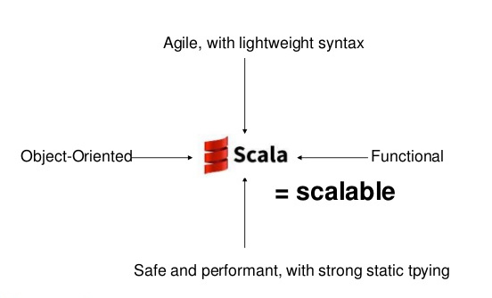

# Table of Contents

* Introduction
* Static semantics
* Dynamic semantics

---

{ width=50%; height=50% }

---

# History

From [A Brief, Incomplete, and Mostly Wrong History of Programming Languages by James
Iry](http://james-iry.blogspot.nl/2009/05/brief-incomplete-and-mostly-wrong.html)

...

**2003** - A drunken Martin Odersky sees a Reese's Peanut Butter Cup ad featuring
somebody's peanut butter getting on somebody else's chocolate and has an idea.
He creates Scala, a language that unifies constructs from both object oriented
and functional languages. This pisses off both groups and each promptly declares
jihad.


---

# History

* Scala = Scalable language
* Released in 2003
* Created by Prof. Martin Odersky at EPFL

---

# The full picture

{ width=50%; height=50% }

---

# Is Scala popular?

* Twitter
* Linkedin
* The Guardian
* FourSquare
* Sony
* etc.

* TIOBE index blabla
* Redmonk index blabla

---

# Projects

* PlayFramework
* Akka
* Sinatra
* React

---

# Overview of features


{ width=80% }


# Object oriented but ...

* Scala approach to OO programming is quite different from Java
* Scala features different constructions and also lacks some others
..- [Abstract] Classes
..- Traits
..- Objects

```scala
class Dog(name : String){
  def sound : Unit = println("Woof!")
  def movement : String = "Walk"
}
```

```java
class Dog{
  private String name;
  public Dog(String name){
    this.name = name;
  }
  public void sound(){
    System.out.println("Woof!")
  }
  public String movement(){
    return("Walk")
  }
}
```
---

# Abstract classes

---

# Object

Examples.

---


# Classes

|              | Class | Abstract class | Trait  | Case class | Object |
|:------------:|:-----:|:--------------:|:------:|:----------:|:------:|
| Type parameter|       |                |        |            |
| Value parameter             |       |                |        |            |
| Composition       |       |                |        |            |
| Abstract members  |       |                |        |            |
| Concrete members  |       |                |        |            |
|              |       |                |        |            |
|              |       |                |        |            |


---

# Traits

* Traits are the fundamental unit of code reuse in Scala

* A trait encapsulates method and field definitions that can be reused by any
  class through **mixin composition**

* Unlike class inheritance, a class may __mix in__ any number of traits.

* We will see how this works in practice

---

# Traits as stackable modifications

## A simple Queue

```scala
import scala.collection.mutable.ArrayBuffer

trait Queue[A] {
  def get() : A
  def put(x : A) : Unit
}

class BasicIntQueue extends Queue[Int] {
  private val buf = new ArrayBuffer[Int]
  def get() : Int = buf.remove(0)
  def put(x : Int) : Unit = buf += x
  }
```

---

# Traits as stackable modifications (II)

* Now suppose we want to modify the behaviour of the BasicIntQueue in different
  ways
 1. *Doubling* the integers that are inserted in the Queue
 2. *Incrementing* the integers that are inserted in the Queue
 3. *Filtering* out negative integers from the Queue

* How do we do that without modifying the existing code?

---

# Traits as stackable modifications (III)

```scala
trait Doubling extends Queue[Int] {
  abstract override def put(x : Int) : Unit = {
    super.put(2 * x)
  }
}
trait Incrementing extends Queue[Int] {
  abstract override def put(x : Int) : Unit = {
    super.put(1 + x)
  }
}
trait Filtering extends Queue[Int] {
  abstract override def put(x : Int) : Unit = {
    if (x > 0) super.put(x)
  }
}
```

---

# Traits as stackable modifications (IIII)

```scala
scala> val q1 =
  | new BasicIntQueue with Incrementing
                      with Filtering
q1: BasicIntQueue with Incrementing with Filtering =
$anon$1@f5a7226

scala> q1.put(0)

scala> q1.get()
java.lang.IndexOutOfBoundsException: 0
  at scala.collection.mutable.ResizableArray. ...
  ...
  at BasicIntQueue.get(<console>:15)
  ... 31 elided
```

---

# Traits as stackable modifications (IV)

```scala
scala> val q2 =
  | new BasicIntQueue with Filtering
                      with Incrementing
q2: BasicIntQueue with Filtering with Incrementing =
$anon$1@6f731759

scala> q2.put(0)

scala> q2.get()
res7: Int = 1
```

---

# Mixin composition & Linearization

* When resolving the calls to __super__, the mixins are resolved through a
* This allows for blabla

---

# Type system


{ width=80% }

---

# Traits as ad-hoc polymorphism (with implicits)

* We can use *traits* to model Haskell's *type classes*
```scala
trait Monoid[A] {
  def mempty : A
  def mappend(x : A, y : A) : A
}
```
* An instance for the type class represented by a trait is just a _value_
  implementing such trait
```scala
object IntMonoid extends Monoid[Int] {
  def mempty : Int = 0
  def mappend(x : Int, y : Int) : Int = x + y
}
```

---

# Traits as ad-hoc polymorphism (with implicits) (II)

* For example now we can define a function such as __foldMap__

```scala
def foldMap[A,M](f : A => M)
                (xs : List[A])
                (ma : Monoid[M]) : M = {
  xs.foldLeft(ma.mempty)
             ((x : M, y : A) => ma.mappend(x, f(y)))
}
```

```scala
scala> foldMap((x : Int) => x)
              (List(1,2,3,4,5))
              (IntMonoid)
res1: Int = 15
```

---

# Traits as ad-hoc polymorphism (with implicits) (III)

* Its a bit cumbersome to pass all around the instance for `Monoid[Int]`...

* Scala allows us to declare some parameters as __implicit__

```scala
implicit object IntMonoid extends Monoid[Int] ...

def foldMap[A,M](f : A => M)
                (xs : List[A])
                (implicit ma : Monoid[M]) : M = ...
```
```scala
scala> foldMap((x : Int) => x)(List(1,2,3,4,5))
res1: Int = 15
```

---

# Traits as ad-hoc polymorphism (with implicits) (IV)

* The compiler is in charge of figuring out the correct implementation
for an __implicit__ declared argument.

* If there are several that match the required type then apply some
  rules of preference. Or in the extreme case raises an error.

* Moreless works like Haskell class resolution (+ OverloadedInstances).

* But is nice that instances are first class objects because we can
  __explicitly__ pass them as arguments.

---

# Traits as ad-hoc polymorphism (with implicits) (V)
```scala
object ProdIntMonoid extends Monoid[Int] ...
implicit object PlusIntMonoid extends Monoid[Int] ...

def foldMap[A,M](f : A => M)
                (xs : List[A])
                (implicit ma : Monoid[M]) : M = ...
```
```scala
scala> foldMap((x : Int) => x)(List(1,2,3,4,5))
res1: Int = 15

scala> foldMap((x : Int) => x)(List(1,2,3,4,5))
              (ProdIntMonoid)
res2: Int = 120
```
---

# Traits as Generalized Algebraic Datatypes (GADTs)

* With a combination of __case classes__ and __traits__ we can
easily implement (Generalized) ADT.

* simpe Expr language in Scala using case classes
* pattern matching (show using eval function)

---

# Functions
Several approaches:
* Methods of objects
* First class functions, allowing higher order functions

---

# Anonymous function

```scala
scala> values.map(x => x + 1)
res3: List[Int] = List(2, 3, 4, 5, 6, 7, 8, 9, 10, 11)
```
---

# Function types

A => B is an abbrevication for the class scala.Function1[A,B]
package scala
```scala
trait Function1[A,B]{
  def apply(x : A) : B
}
```
```scala
traits Function2...Function22
```
---

# Anonymous function

Anonymous function
(x : Int) => x + 1

This will be expanded to  (Same syntax as Java)
```scala
new Function1[Int,Int]{
	def apply(x : Int) : Int = x + 1
}
```

---

# Apply method


---

# Currying


---

# Currying - Anonymous function
```scala
var f = (x : Int) => (y : Int) => x + 1
f: Int => (Int => Int) = $$Lambda$1113/551797833@2c58dcb1

scala> f(1)
res0: Int => Int = $$Lambda$1130/1813375175@56380231

scala> f(1)(2)
res1: Int = 2
```

---

# Case Classes

```scala
case class Person(name : String) extends Animal{
  def noise = "I am a person"
}
case class Tiger() extends Animal{
  override def noise : String = "Grr"
}

case class Frog() extends Animal{
  def noise : String = "CROAK"
}
```
---

# Pattern Match

```scala
object AnimalNoise{
  def mkSound(animal : Animal) : Unit =
    animal match {
      case Frog() => println(Frog().noise)
      case Person(name) => println(name)
      case x => println(x.noise)
    }
}
```
---

# Pattern Match

```scala
object pattern{
  def all(allTypes : Any) : Unit = {
    allTypes match{
      case (x,1) => println("(x,1)")
      case (x,y) => println("(x,y)")
      case x : String => println(x)
      case Tiger() => println(Tiger().noise)
      case 1 => println("One")
      case true => print("True")
    }
  }
}
```

---

# Evaluation
```scala
class LazyMethod(values : () => List[List[String]]) {
    def heavyComputation : List[String] = {
      for(value <- values; n <- value)
        for(value1 <- values; n1 <- value)
          for(value2 <- values; n2 <- value)
            for(value3 <- values; n3 <- value)
              for(value4 <- values; n4 <- value)
    }
}
```
...

---

# Conclusion


<!-- Local Variables:  -->
<!-- pandoc/write: beamer -->
<!-- pandoc/latex-engine: "xelatex" -->
<!-- pandoc/template: "beamer-template.tex" -->
<!-- End:  -->
