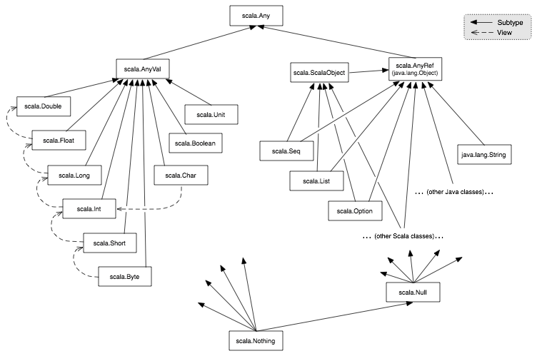

# Introduction

* Background information
* Scalat
* Conclusion

---

# History

* 2001
* École Polytechnique Fédérale de Lausanne (EPFL) by Martin Odersky

---

# Companies (Not sure)

* Twitter
* Linkedin
* The Guardian
* FourSquare
* Sony
* etc.

---

# Projects

* PlayFramework
* Akka

---

# Scala (Still need to add a picture)

* Object oriented
* Functional
* 

---

# REPL


{ width=80% }

---

# Mutable and immutable

{ width=80% }

---

# For loops

```scala
object ForLoops {
  def forEach(values : List[String]) : Unit = {
    for(value <- values){
      println(value)
    }
  }
  def rangeLoop(): Unit ={
    for( i <- 0 to 10){
        print(i)
    }
  }
  def rangeUntilLoop(): Unit ={
    for( i <- 0 until 10){
      print(i)
    }
  }
}
```

---

# For loops

```scala
object ForLoops {
  def filterLoop(values : List[Int]): Unit ={
    for( value <- values if (value % 2 == 0)){
      print(value)
    }
  }
  def concatList(values : List[List[Any]]) : List[Any] = {
    for(value <- values; n <- value) yield n
  }

}
```


---

# Anonymous function

Anonymous function
(x : Int) => x + 1

This will be expanded to  (Same syntax as Java)
```scala
new Function1[Int,Int]{
	def apply(x : Int) : Int = x + 1
}
```

---

# Hierarchy


{ width=80% }

---

# Apply method


---

# Classes

```scala
class Dog(name : String){
  def sound : Unit = println("Woof!")
  def movement : String = "Walk"
}
```

```java
class Dog{
	private String name;
	public Dog(String name){
		this.name = name;
	}
	public void sound(){
		System.out.println("Woof!")
	}
	public String movement(){
 		return("Walk")
	}
}
```
---

# Abstract classes

Examples

---


# Anonymous class


---

# Case Classes

```scala
case class Person(name : String) extends Animal{
  def noise = "I am a person"
}
case class Tiger() extends Animal{
  override def noise : String = "Grr"
}

case class Frog() extends Animal{
  def noise : String = "CROAK"
}
```
---

# Pattern Match

```scala
object AnimalNoise{
  def mkSound(animal : Animal) : Unit =
    animal match {
      case Frog() => println(Frog().noise)
      case Person(name) => println(name)
      case x => println(x.noise)
    }
}
```
---

# Pattern Match

```scala
object pattern{
  def all(allTypes : Any) : Unit = {
    allTypes match{
      case (x,1) => println("(x,1)")
      case (x,y) => println("(x,y)")
      case x : String => println(x)
      case Tiger() => println(Tiger().noise)
      case 1 => println("One")
      case true => print("True")
    }
  }
}
```
---


# Object

Examples.

---

# Mixin

Traits.

---

# Traits

example

---

# Mixin - Example

example

---

# Sealed

example

---

# Classes

|              | Class | Abstract class | object | object | trait |
|:------------:|:-----:|:--------------:|:------:|:------:|:-----:|
| Inherentence |       |                |        |        |       |
|  Cmposition  |       |                |        |        |       |
|  Parameters  |       |                |        |        |       |
|              |       |                |        |        |       |
|              |       |                |        |        |       |


# Tuples

---

# Evaluation
```scala
class LazyMethod(values : () => List[List[String]]) {
    def heavyComputation : List[String] = {
      for(value <- values; n <- value)
        for(value1 <- values; n1 <- value)
          for(value2 <- values; n2 <- value)
            for(value3 <- values; n3 <- value)
              for(value4 <- values; n4 <- value)
    }
}
```
...

# Currying


---

# Currying - Anonymous function
```scala
var f = (x : Int) => (y : Int) => x + 1
f: Int => (Int => Int) = $$Lambda$1113/551797833@2c58dcb1

scala> f(1)
res0: Int => Int = $$Lambda$1130/1813375175@56380231

scala> f(1)(2)
res1: Int = 2
```
---

# Typeclasses

example

---

# Typeclasses Scala

example

---

# Generics

example

---

# Generics
```scala
class GParent
class Parent extends GParent
class Child extends Parent
class ChildOfChild extends Child
case class Children[A <: Child](value : A)
case class Children1(Value : Child)
case class Ancestors[A >: Child](value : A)
case class Family[P >: Parent, C <: Child]
		(ancestors : (P,P), children : List[C])
```
...

# Functions as objects

In fact function values are treated as objects in Scala

The function type A => B is just an abbreviation for the class
scala.Function1[A,B], which is roughly defined as follows.

```scala
package scala
trait Function1[A,B]{
  def apply(x : A) : B
}
```
So functions are object with apply methods

There are also traits Functions2, Function3, ... for functions which take more parameters (Currently up to 22)


---


# Expansion of Function values

An anomymous function such as
```scala
(x : Int) => x * x
```
is expanded to
```scala
{class AnonFun extends Function1[Int.Int]{
    def apply(x : Int) = x * x
  }
  new AnonFun}
```
or, shorter, using anonymous class syntax:
```scala
new Function1[Int,Int]{
  def apply(x : Int) = x * x
}
```
---

# Expansion of Function Calls

A function call, such as f(a,b), where f is a value of some class type, is expanded to
```scala
f.apply(a,b)
```
So the OO-translation of
```scala
val f = (x : int) => x * x
f(7)
```

would be
```scala
val f = new Function[Int,Int]{
  def apply(x : Int) = x * x
}
f.apply(7)
```

---

# Functions and Methods

Note that a method such as
```scala
def f(x : Int) : Boolean = ???
```

is not itself a function value.

But if f is used in a place where a Function type is expected, it is converted automatically to the function value
```scala
(x : Int) => f(x)
```
or, expanded
```scala
new Function1[Int,Boolean]{
  def apply(x : Int) = f(x)
}
```
---

# Dynamic semantics

How does Scala evaluate expressions?

* Strict
* Lazy

---

# Dynamic semantics
```scala
def cyclicStream(x:Int): Stream[Int] = {
  x #:: cyclicStream(x-1)
}              
def cyclicList(x:Int): List[Int] = {
  x :: cyclicList(x-1)
}
scala> cyclicStream(Int.MaxValue)
   final val MaxValue: Int(2147483647)

scala> cyclicStream(Int.MaxValue)
res1: Stream[Int] = Stream(2147483647, ?)

scala> cyclicList(Int.MaxValue)
java.lang.StackOverflowError
  at .cyclicList(<console>:11)
```

---


# Dynamic semantics
```scala
def CallByValue(x: Int) = {
  println("x1=" + x)
  println("x2=" + x)
}
def callByName(x: => Int) = {
  println("x1=" + x)
  println("x2=" + x)
}
def zeroArityFunction(x: () => Int) = {
  println("x1=" + x())
  println("x2=" + x())
}
```

---

# Dynamic semantics
```scala
def something() : Int = {
  println("calling something")
  1
}
```

---

# Dynamic semantics - Call by value
```scala
def something() : Int = {
  println("calling something")
  1
}
def CallByValue(x: Int) = {
  println("x1=" + x)
  println("x2=" + x)
}
scala> CallByValue(something())
calling something
x1=1
x2=1
```

---

# Dynamic semantics - Call by name
```scala
def something() : Int = {
  println("calling something")
  1
}
def callByName(x: => Int) = {
  println("x1=" + x)
  println("x2=" + x)
}
scala> callByName(something())
...

```

---

# Dynamic semantics - Call by name
```scala
def something() : Int = {
  println("calling something")
  1
}
def callByName(x: => Int) = {
  println("x1=" + x)
  println("x2=" + x)
}
scala> callByName(something())
calling something
x1=1
calling something
x2=1

```

---

# Dynamic semantics
```scala
def something() : Int = {
  println("calling something")
  1
}
def zeroArityFunction(x: () => Int) = {
  println("x1=" + x())
  println("x2=" + x())
}
scala> zeroArityFunction(something())
<console>:14: error: type mismatch;
 found   : Int
 required: () => Int

```

---

# Dynamic semantics - 0-arity-function
```scala
def something() : Int = {
  println("calling something")
  1
}
def zeroArityFunction(x: () => Int) = {
  println("x1=" + x())
  println("x2=" + x())
}
scala> zeroArityFunction(() => something())
...


```

---

# Dynamic semantics - 0-arity-function
```scala
def something() : Int = {
  println("calling something")
  1
}
def zeroArityFunction(x: () => Int) = {
  println("x1=" + x())
  println("x2=" + x())
}
scala> zeroArityFunction(() => something())
calling something
x1=1
calling something
x2=1

```

---

# Dynamic semantics - Lazy keyword
```scala
scala> lazy val number1 = { println("I am a number "); 13 }
number1: Int = <lazy>

scala> val number2 = { println("I am a number: "); 20 }
I am a number: 
number2: Int = 20


```

---

# Dynamic semantics - Lazy keyword
```scala
scala> lazy val number1 = { println("I am a number "); 13 }
number1: Int = <lazy>

scala> number1
I am a number 
res0: Int = 13

scala> number1
...


```
---

# Dynamic semantics - Lazy keyword
```scala
scala> lazy val number1 = { println("I am a number "); 13 }
number1: Int = <lazy>

scala> number1
I am a number 
res0: Int = 13

scala> number1
res2: Int = 13


```
---

# Dynamic semantics - Lazy keyword
```scala
scala> lazy val number1 = { println("I am a number "); 13 }
number1: Int = <lazy>

scala> val number2 = { println("I am a number: "); 20 }
I am a number: 
number2: Int = 20

scala> number2
res1: Int = 20

scala> number2
res3: Int = 20
```

---

# Dynamic semantics - Lazy keyword
```scala
scala> lazy val number1 = { println("I am a number "); 13 }
number1: Int = <lazy>

scala> val number2 = { println("I am a number: "); 20 }
I am a number: 
number2: Int = 20

scala> number2
res1: Int = 20

...
```

---

# Dynamic semantics - summary

* Call by value
* Call by name
* Call by need

---

# Java interoptibility

* JVM
* Use Java form Scala - Easy
* Use Scala from Java - Harder
* Call by need

---


# Questions

Eend


<!-- Local Variables:  -->
<!-- pandoc/write: beamer -->
<!-- pandoc/latex-engine: "xelatex" -->
<!-- pandoc/template: "beamer-template.tex" -->
<!-- End:  -->
